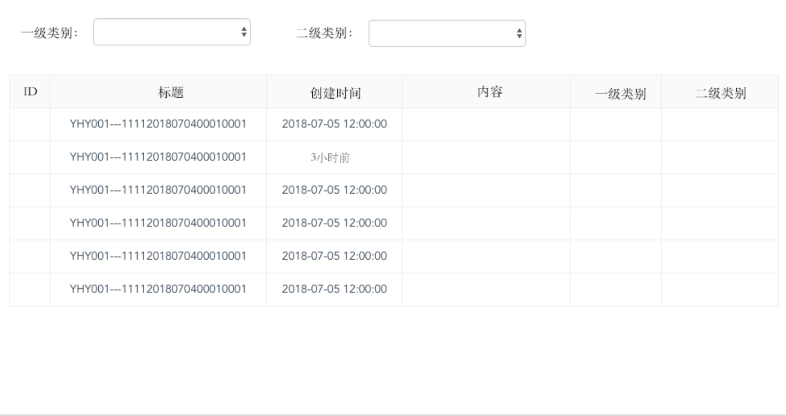

# 面试-上机
>时间：半小时，特别提醒：请自行评估各功能点所需时间，合理安排时间。
---


### 利用给定的后端接口，自行建立vue工程，并尽可能完成上述图片中描述的界面。注意点：

``` bash
1: 一级类别和二级类别具有联动关系

2: 一级类别或二级类别变化后，自动检索并刷新下方记录列表

3: 下方记录列表中的创建时间，可以直接显示后端返回的结果，也可以处理成图例中给出的第二行数据的形式（计算后端返回的时间距离当前时间的间隔）

4: 下方记录列表中的“一级类别”和“二级类别”两列，用于显示记录所属类别的名称（name）
```

> 后端接口：


# 获取类别列表（对应界面上方类别列表）

> 服务地址
``` html
GET http://interview-test.ipmapp.cn/api/v1/classify?parent=0
```

| 名称  | 说明  | 备注
|:----:|:----:|:----:|
|parant|父类别索引|0表示检索一级类别

> 服务响应的格式：
``` json
{
    "code":200, //200~299之间表示成功
    "page":{
        "count":5,
        "size":5,
        "current":1
    },
    "data":[
        {
            "id":1,
            "parent":0,
            "name":"分类1"
        }
    ]
}
```

# 获取记录列表(上面的表格数据区域)


> 服务地址
``` html
GET http://interview-test.ipmapp.cn/api/v1/record?classify=0
```

| 名称  | 说明  | 备注
|:----:|:----:|:----:|
|classify|所属类别索引(可选)|为类别列表编号()|

> 服务响应的格式：
``` json
{
    "code":200,//200~299之间表示成功
    "page":{
        "count":25,
        "size":25,
        "current":1
    },
    "data":[
        {
            "id":1,
            "classify":6,
            "title":"C101",
            "content":"C101C101",
            "created_time":"2018-01-01 12:00:00"
        }
    ]
}
```

